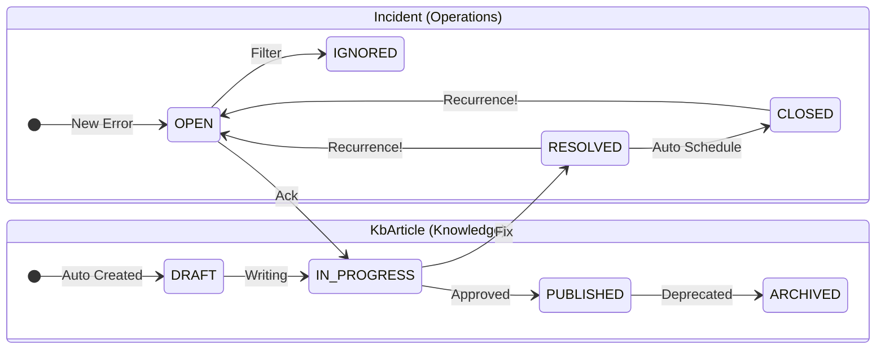

# LogCollector & KnowledgeBase
### 로그에서 지식으로 (From Logs to Knowledge Assets) v1.0

> **"운영 환경의 에러 로그, 버리고 계신가요?"**

단순히 로그를 수집하는 시스템은 이미 많습니다.
LogCollector & KnowledgeBase는 **에러 로그를 사건(Incident) 단위로 식별하고, 대응 과정을 지식(KnowledgeBase)으로 축적·재활용**하는 것을 목표로 한 백엔드 중심 프로젝트입니다.

이 프로젝트는 단순 로깅이 아니라, **“에러 발생 → 사건 관리 → 재발 대응 → 지식화”** 로 이어지는 전체 운영 흐름을 **아키텍처 관점에서 구현**하는 데 초점을 두었습니다.

---

## 🚀 Quick Demo (Visual)

복잡한 설정 없이 시스템 동작을 눈으로 확인할 수 있습니다.

**1. 대시보드 접속**
- 주소: [http://localhost](http://localhost)

**2. 시나리오 실행 (로그 발생 시뮬레이션)**
- 대시보드 상단 `Scenario Mode` 탭 클릭
- `DB_FAILOVER` 등 시나리오 선택 후 `▶ Run Simulation` 버튼 클릭

**3. 결과 확인**
- **Frontend**: `Logs` 탭에서 실시간 로그 유입 및 Incident 생성 확인
- **Grafana**: [http://localhost:3000](http://localhost:3000) (ID: `admin` / PW: `admin`)
  - `LogCollector` 대시보드에서 트래픽 및 에러 그래프 변화 확인

---

## 🎯 Project Goal

운영 환경의 로그는 파편화되어 있고, 대부분 일회성으로 소비된 뒤 사라집니다. 그 결과 동일한 장애가 반복되어도 대응 경험은 개인의 기억에만 의존하게 됩니다.

이 프로젝트는 다음 두 가지 문제를 해결합니다.

1.  **Noise Reduction**
  - 반복적으로 발생하는 에러 로그를 하나의 **사건(Incident)**으로 묶어 관리합니다.
2.  **Knowledge Assetization**
  - 장애 대응 경험을 코드와 데이터 구조를 통해 **시스템의 지식 자산**으로 축적합니다.

---

## 🏗 Architecture Overview

이 프로젝트는 **LogCollector(LC)**, **Incident**, **KbArticle** 세 가지 핵심 컴포넌트로 구성되며, **Writer of Truth** 전략을 통해 데이터 정합성을 유지합니다.

아래 다이어그램은 **로그가 유입되어 지식으로 변환되는 Data Flow와 책임의 분리(LC vs KB)** 를 표현합니다.

```mermaid
graph TD
    %% 스타일 정의
    classDef external fill:#f9f9f9,stroke:#333,stroke-dasharray: 5 5;
    classDef db fill:#e1f5fe,stroke:#0277bd;
    classDef component fill:#fff3e0,stroke:#ff6f00;
    classDef cache fill:#fce4ec,stroke:#c2185b;
    classDef frontend fill:#e8f5e9,stroke:#2e7d32;

    %% 외부 시스템
    subgraph External["External Systems"]
        ClientApp[Client Applications]:::external
    end

    %% Frontend
    subgraph UI["Frontend (React)"]
        Dashboard[Admin Dashboard]:::frontend
    end

    %% Backend System
    subgraph Backend["LogCollector & KB (Spring Boot)"]
        
        %% LogCollector Domain
        subgraph LC_Domain["LogCollector Domain (LC)"]
            Ingestion[Log Ingestion API]:::component
            Normalizer[Log Normalizer]:::component
            Hasher[Hasher & Dedup]:::component
        end

        %% KnowledgeBase Domain
        subgraph KB_Domain["KnowledgeBase Domain (KB)"]
            IncidentMgr[Incident Manager]:::component
            DraftPolicy[Draft Policy Engine]:::component
            KbWriter[KbArticle Writer]:::component
        end

    end

    %% Data Store Layer
    subgraph DataStore["Data Persistence Layer"]
        Redis[(Redis Cache<br/>Dedup & Throttling)]:::cache
        DB_LC[(MariaDB: LC<br/>Raw Error Logs)]:::db
        DB_KB[(MariaDB: KB<br/>Incidents & Articles)]:::db
    end

    %% Flow Connections
    ClientApp -->|1. Error Logs| Ingestion
    
    %% LC Flow
    Ingestion --> Normalizer
    Normalizer --> Hasher
    Hasher <-->|2. Check Duplicate| Redis
    Hasher -->|3. Save Raw Log| DB_LC

    %% KB Flow
    Hasher -->|4. Create/Update (Projection)| IncidentMgr
    IncidentMgr -->|5. Sync Status| DB_KB
    
    %% Knowledge Flow
    IncidentMgr -.->|6. Trigger (Async)| DraftPolicy
    DraftPolicy -->|7. Create Draft| KbWriter
    KbWriter -->|8. Store Knowledge| DB_KB

    %% UI Connections
    Dashboard <-->|Query & Manage| IncidentMgr
    Dashboard <-->|Write Truth| KbWriter

    %% Link Style
    linkStyle default stroke:#333,stroke-width:2px;
 ```


### Core Concepts

* **LogCollector (LC)**: 대량 로그 수집, 정규화(Normalize), 해싱 및 중복 제거 (전처리 전용)
* **Incident (Operations View)**: 운영자가 인지하는 "현재 사건". LC와 KB를 연결하는 Projection 계층.
* **KbArticle (Knowledge View)**: 실제 지식이 저장되는 도메인. 대응 이력과 결론이 누적되는 **Writer of Truth**.

### Reoccurrence First Design (재발 우선 설계)
운영 환경에서 에러는 반드시 재발한다는 가정을 전제로 합니다. 동일 `log_hash` 재발 시 Incident는 자동으로 Reopen 되며, 지식은 누적됩니다.

---

## 🛠 Tech Stack

* **Language & Framework**: Java 17, Spring Boot 3.4.1
* **Database**:
  * MariaDB (LC / KB 물리적 분리 구조)
  * Redis (Caching & Deduplication)
  * JPA / Querydsl
* **Infrastructure**: Docker, Docker Compose, Kubernetes (Optional)

---

## ✅ Verification Paths

이 프로젝트는 실행 환경별로 검증 경로를 분리하여 제공합니다.

### 1) Local (run-local)
* **목적**: IDE(IntelliJ) 기반 개발 및 디버깅
* **문서**: [`docs/run-local.md`](docs/run-local.md)
* **참고**: 프론트엔드 제공 없음, `curl` 또는 `.http` 파일로 API 검증

### 2) Docker (run-docker) — 주요 검증 경로
* **목적**: 로컬 환경과 격리된, 재현 가능한 통합 실행
* **문서**: [`docs/run-docker.md`](docs/run-docker.md)
* **API Base URL**: `http://localhost:8080/api`

**빠른 실행 및 검증 (Windows PowerShell):**

```bash
# 컨테이너 실행
docker compose -f infra/compose/compose.yaml up -d --build

# API 테스트 (Windows)
./test-api.ps1

# 또는 IntelliJ HTTP Client 사용
# api-test.http 파일 실행
```

### 3) Kubernetes (run-k8s) & Automated Test
* **목적**: 클러스터 내부 통합 테스트 (Job 기반)
* **문서**: [`docs/verify-k8s.md`](docs/verify-k8s.md)

**CLI Verification (Automated):**
쿠버네티스 클러스터 내부에서 통합 테스트를 수행합니다.

```bash
make test
```
> **성공 기준**: 터미널 마지막에 `>>> ✅ ALL TESTS PASSED!` 메시지가 출력되면 정상입니다.

---

## 📊 Status Model

상태 관리는 **Incident(운영)**와 **KbArticle(지식)**로 이원화되어 관리됩니다.
특히 Incident는 **재발(Reoccurrence)**시 자동으로 상태가 회귀되는 생명주기를 가집니다.



### Key Rules
1. **Incident is SoT**: 모든 상태의 기준은 Incident입니다.
2. **Reopen on Recurrence**: `RESOLVED`나 `CLOSED` 된 사건이라도, 동일 해시의 로그가 유입되면 즉시 `OPEN` 상태로 전환되어 운영자에게 알립니다.
3. 상세 정책: [`docs/status.md`](docs/status.md)

---

## 📝 Scope & Limitations (v1.0)

v1.0의 목적은 **기능 나열이 아니라, 운영 흐름과 데이터 책임 구조의 검증**입니다. 따라서 아래 항목들은 아키텍처 검증의 집중을 위해 후순위로 제외되었습니다.

* **Elasticsearch / Full-text Search**: 구조적 지식 축적이 우선임
* **AI 자동 요약**: 데이터 구조의 일관성 증명이 선행되어야 함
* **분산 트랜잭션 (2PC)**: Eventual Consistency + 멱등성 설계로 운영 환경 커버 가능함

---

## 📂 Documentation Link
* [Local Run Guide](docs/run-local.md)
* [Docker Run Guide](docs/run-docker.md)
* [Status Specification](docs/status.md)