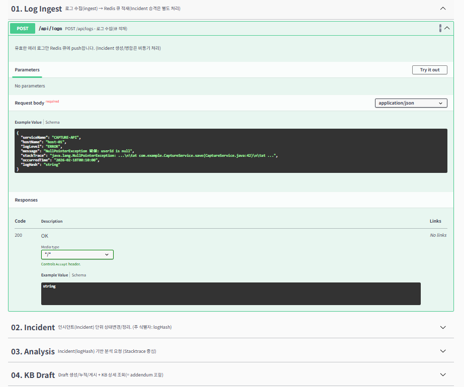
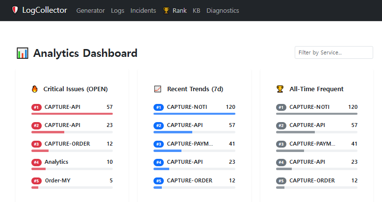
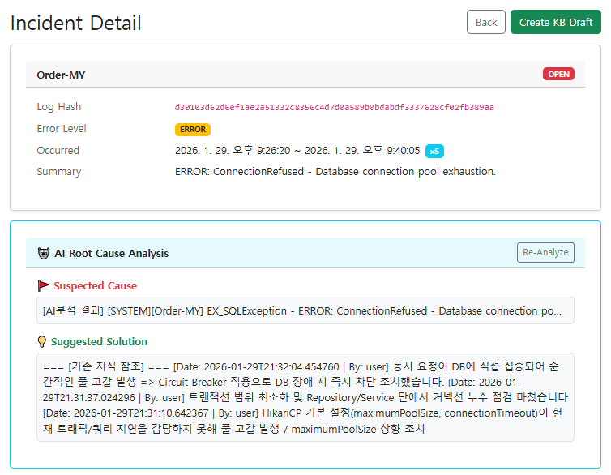
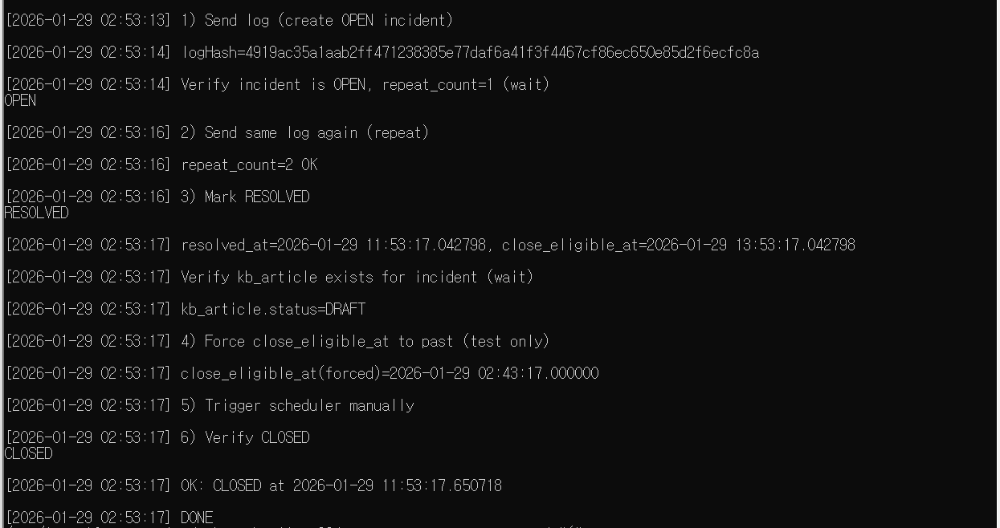
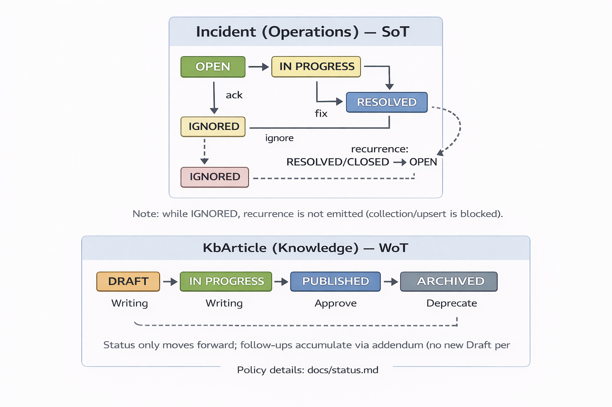
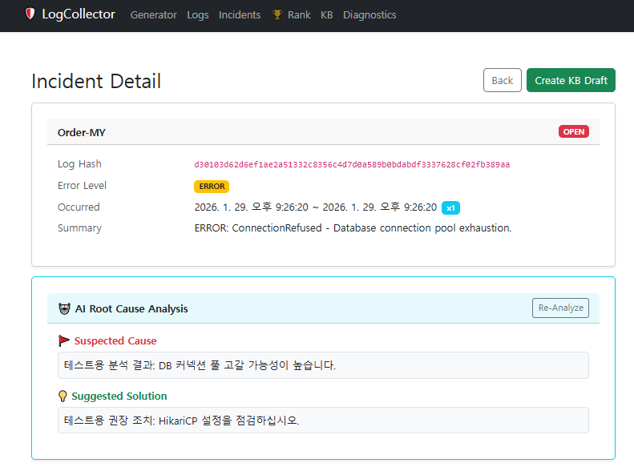

# LogCollector & KnowledgeBase
### 로그에서 지식으로 (From Logs to Knowledge Assets) v1.0

> **“운영 환경의 에러 로그, 버리고 계신가요?”**

단순히 로그를 수집하는 시스템은 이미 많습니다.  
LogCollector & KnowledgeBase는 **에러 로그를 사건(Incident) 단위로 식별하고, 대응 과정을 지식(KnowledgeBase)으로 축적·재활용**하는 것을 목표로 한 백엔드 중심 프로젝트입니다.

이 프로젝트는 단순 로깅이 아니라,  
**에러 발생 → 사건 관리 → 재발 대응 → 지식화** 로 이어지는 운영 흐름을  
**아키텍처와 데이터 책임 구조 차원에서 구현/검증**하는 데 초점을 둡니다.

---

## Quick Demo (Visual)

1) **대시보드 접속**
- http://localhost

2) **시나리오 실행 (로그 발생 시뮬레이션)**
- 상단 `Scenario Mode` 탭 → `DB_FAILOVER` 등 시나리오 선택 → `Run Simulation`

3) **결과 확인**

<p align="center">
  
</p>

- Swagger-UI : http://localhost:8080/swagger-ui/index.html

3-2) **Frontend**: `Logs` 탭에서 실시간 로그 유입 및 Incident 생성 확인

<p align="center">
  
</p>

<!-- 필요 시 복원
<p align="center">
  
</p>
-->

- Grafana: http://localhost:3000 (admin / admin)
  - `LogCollector` 대시보드에서 트래픽/에러 변화 확인

---

## Project Goal

운영 환경의 로그는 파편화되어 있고 대부분 일회성으로 소비됩니다.  
그 결과 동일한 장애가 반복되어도 대응 경험은 개인의 기억에만 의존하게 됩니다.

이 프로젝트는 다음 두 가지 문제를 해결합니다.

- **Noise Reduction**  
  반복 에러 로그를 하나의 Incident로 묶어 운영 관점에서 관리

- **Knowledge Assetization**  
  장애 대응 경험을 지식(KB)으로 축적해 재발 대응 비용을 낮춤

---

## Architecture Overview

핵심 구성요소는 **LogCollector(LC)**, **Incident**, **KbArticle** 입니다.

- **Incident = Source of Truth (SoT)**: 운영 상태/재발/종료 정책의 기준
- **KbArticle = Writer of Truth (WoT)**: 지식 쓰기의 단일 진실 지점

아래 다이어그램은 로그 유입부터 지식화까지의 핵심 흐름을 단순화한 그림입니다.

<p align="center">
  
</p>

### Core Concepts

- **LogCollector (LC)**  
  로그 수집, 정규화, 해싱, 중복 제거를 담당하는 전처리 계층

- **Incident (Operations View / SoT)**  
  운영자가 보는 “현재 사건”의 단위  
  상태 관리 및 재발 판단의 단일 기준

- **KbArticle (Knowledge View / WoT)**  
  대응 결과를 지식으로 확정/축적하는 단일 쓰기 지점  
  재발 시 지식은 삭제되지 않고 이력으로 누적됨

---

## Tech Stack

- Java 17, Spring Boot 3.4.1
- MariaDB (LC / KB 물리적 분리)
- Redis (Deduplication, Cache)
- JPA / Querydsl
- Docker, Docker Compose
- Kubernetes (Optional)

---

## Verification Paths

실행 환경별로 검증 경로를 분리합니다.

### 1) Local (run-local)
- 목적: IDE(IntelliJ) 기반 개발/디버깅
- 문서: [docs/run-local.md](docs/run-local.md)
- 참고: 프론트엔드 없음, curl 또는 IntelliJ HTTP Client 기반 검증

### 2) Docker (run-docker) — 주요 검증 경로
- 목적: 재현 가능한 통합 실행
- 문서: [docs/run-docker.md](docs/run-docker.md)
- API Base URL: `http://localhost:8080/api`

```bash
docker compose -f infra/compose/compose.yaml up -d --build
./test-api.ps1
```

### 3) Kubernetes (run-k8s) & Automated Test
- 목적: 클러스터 내부 통합 테스트(Job 기반)
- 문서:
  - [docs/run-k8s.md](docs/run-k8s.md)
  - [docs/verify-k8s.md](docs/verify-k8s.md)

```bash
make test
```

<p align="center">
  
</p>

성공 시 터미널 마지막에 `ALL TESTS PASSED!` 메시지가 출력됩니다.

---

## Status Model

상태 관리는 **Incident(운영)** 와 **KbArticle(지식)** 로 분리됩니다.  
상태 정책의 단일 기준은 Incident이며, 재발 시 `RESOLVED/CLOSED → OPEN` 전이를 허용합니다.

<p align="center">
  
</p>

상세 정책: [docs/status.md](docs/status.md)

---

## 💡 Why This Status Model Works (Design Decisions)

### 1. Noise Reduction Strategy (로그 정규화 & 해싱)

- **Problem**: 동일 에러가 수천 건씩 유입되어 운영자의 피로도 증가
- **Solution**: 로그 정규화 후 고유 해시(`log_hash`) 생성  
  → **1,000건의 로그를 1건의 Incident로 압축**

---

### 2. High-Throughput & Deduplication (Redis 분산 처리)

- **Problem**: DB 직접 insert 시 부하 및 중복 체크 비용 증가
- **Solution**: Redis를 1차 Dedup 계층으로 활용  
  → Atomic 연산 기반 분산 정확성 확보

---

### 3. Architecture for Consistency (SoT & Status)

- **Problem**: 로그 수집과 사건 상태 불일치
- **Solution**: Incident를 단일 진실 공급원(SoT)으로 정의  
  → 재발 시 자동 상태 회귀 (Reopen)

---

### 4. Physical Separation of Concerns (Dual DB)

- **Problem**: Write-heavy 로그 트래픽이 비즈니스 로직에 영향
- **Solution**: LC DB / KB DB 물리적 분리  
  → 독립적 스케일링 가능

---

### 5. Hybrid Analysis (OpenAI & Strategy Pattern)

- **Problem**: 초기 KB 부재 시 대응 가이드 부족
- **Solution**: OpenAI 기반 1차 분석 + Draft 자동 생성  
  → Strategy Pattern으로 Mock/실서비스 교체 가능

<p align="center">
  
</p>

---

### 6. Operational Control (Ignore Policy)

- **Problem**: 의미 없는 경고 로그 반복
- **Solution**: Ignore 상태 도입  
  → 운영자가 관심 제외 의도를 명시적으로 시스템에 반영

---

## Scope & Limitations (v1.0)

v1.0의 목적은 기능 확장이 아니라  
**운영 흐름과 데이터 책임 구조의 검증**입니다.

의도적으로 제외:

- Full-text Search (Elasticsearch)
- 2PC 분산 트랜잭션

Eventual Consistency와 멱등성 설계로 운영 환경을 커버할 수 있음을 검증합니다.

---

## Documentation

- [docs/run-local.md](docs/run-local.md)
- [docs/run-docker.md](docs/run-docker.md)
- [docs/run-k8s.md](docs/run-k8s.md)
- [docs/verify-k8s.md](docs/verify-k8s.md)
- [docs/status.md](docs/status.md)
