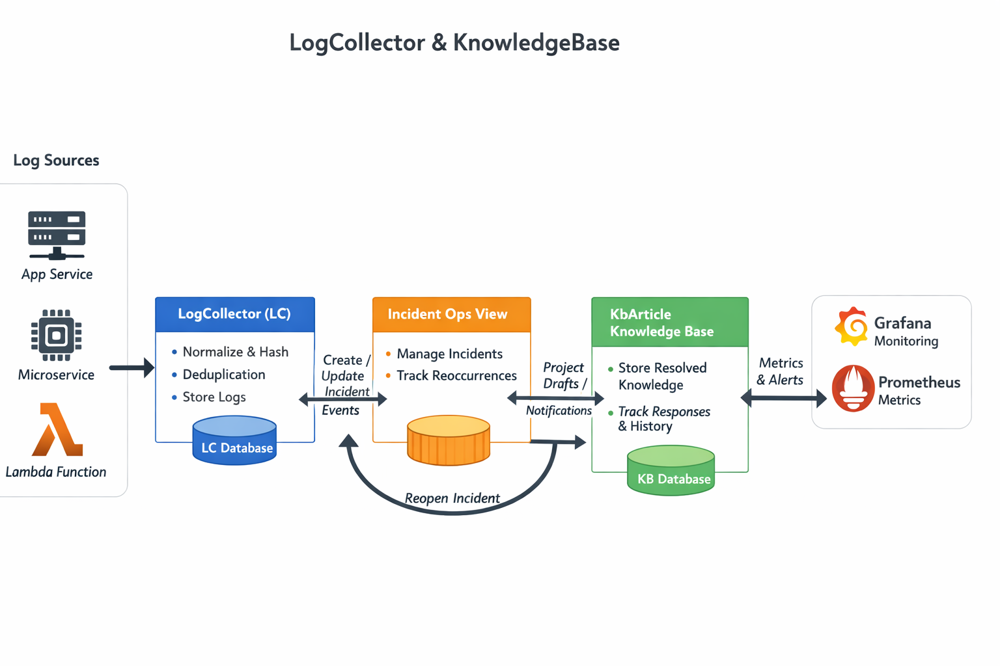

# LogCollector & KnowledgeBase
### 로그에서 지식으로 (v1.0)

단순히 로그를 수집하는 시스템은 이미 많습니다.
LogCollector & KnowledgeBase는 **에러 로그를 사건(Incident) 단위로 식별하고, 대응 과정을 지식(KnowledgeBase)으로 축적·재활용**하는 것을 목표로 한 백엔드 중심 프로젝트입니다.

이 프로젝트는 단순 로깅이 아니라,
**“에러 발생 → 사건 관리 → 재발 대응 → 지식화”** 로 이어지는 전체 운영 흐름을 **아키텍처 관점에서 구현**하는 데 초점을 두었습니다.

---

##  Quick Demo (Visual)
복잡한 설정 없이 시스템 동작을 눈으로 확인할 수 있습니다.

1. **대시보드 접속**: [http://localhost](http://localhost) 접속
2. **시나리오 실행**: `Scenario Mode` 탭 클릭 -> `DB_FAILOVER` 시나리오의 `▶ Run Simulation` 버튼 클릭
3. **결과 확인**:
- **Frontend**: `Logs` 탭에서 실시간 로그 유입 확인
- **Grafana**: [http://localhost:3000](http://localhost:3000) 접속 (admin/admin) -> `LogCollector` 대시보드에서 트래픽 및 에러 그래프 변화 확인

---

##  CLI Verification (Automated)
쿠버네티스 클러스터 내부에서 통합 테스트(Integration Test)를 수행합니다.

```bash
# 통합 테스트 실행 (스크립트 로드 -> Job 실행 -> 결과 출력)
make test
```
> **성공 기준**: 터미널 마지막에 `>>> ✅ ALL TESTS PASSED!` 메시지가 출력되면 정상입니다.

---

## 1. Project Goal — 왜 만들었는가

운영 환경의 로그는 파편화되어 있고, 대부분 일회성으로 소비된 뒤 사라집니다.
그 결과 동일한 장애가 반복되어도 대응 경험은 개인의 기억에만 의존하게 됩니다.

이 프로젝트는 다음 두 가지 문제를 해결하는 것을 목표로 합니다.

- **Noise Reduction**
  반복적으로 발생하는 에러 로그를 하나의 *사건(Incident)* 으로 묶어 관리
- **Knowledge Assetization**
  장애 대응 경험을 코드와 데이터 구조를 통해 **시스템의 지식 자산**으로 축적

---

## 2. High-Level Architecture

아래 다이어그램은 LogCollector & KnowledgeBase의 **전체 데이터 흐름과 책임 분리 구조**를 나타냅니다.



### 흐름 요약
1. 외부 시스템에서 로그 유입
2. LogCollector(LC)에서 로그 정규화 및 해싱
3. Incident 생성/갱신 (운영 관점 Projection)
4. 정책 기반 Draft 생성
5. KbArticle에 지식으로 확정 저장
6. 재발 시 Incident Reopen 및 지식 이력 누적

---

## 3. Core Architecture Concepts

본 시스템은 **LogCollector(LC)**, **Incident**, **KbArticle** 세 가지 핵심 컴포넌트로 구성됩니다.

### 3-1. Responsibility Separation (책임의 분리)

각 컴포넌트는 단일 책임 원칙을 기준으로 명확히 분리되어 있습니다.

- **LogCollector (LC)**
  - 대량 로그 수집
  - 로그 정규화(Normalize)
  - 해싱 및 중복 제거
    → *전처리 전용 모듈*

- **Incident (Operations View)**
  - 운영자가 인지하는 “현재 사건”
  - LC와 KB를 연결하는 Projection 계층
  - 장애 상태 및 재발 관리

- **KbArticle (Knowledge View)**
  - 실제 지식이 저장되는 도메인
  - 대응 이력과 결론이 누적되는 **Writer of Truth**

---

### 3-2. Writer of Truth Strategy

데이터 정합성을 위해 **쓰기 책임을 단일 지점(KbArticle)** 으로 제한했습니다.

- 모든 지식 데이터의 생성/변경은 KbArticle 기준
- Incident는 이를 **조회 및 상태 표현용 Projection** 으로만 사용

이를 통해:
- 상태 불일치 최소화
- 데이터 책임 경계 명확화

---

### 3-3. Reoccurrence First Design (재발 우선 설계)

운영 환경에서 에러는 **반드시 재발한다는 가정**을 전제로 설계했습니다.

- 동일 `log_hash` 재발 시 Incident 자동 Reopen
- 기존 KbArticle 유지 + 대응 이력 누적
- 단발성 대응이 아닌 **지속 학습형 운영 구조**

---

## 4. Data Flow & Consistency Model

LC DB / KB DB로 분리된 멀티 DB 환경에서
본 프로젝트는 **Eventual Consistency(최종 일관성)** 모델을 채택합니다.

### 핵심 전략
- **비동기 동기화**: 실패 허용 + 재시도
- **Idempotent Upsert**: 중복 이벤트에도 안전한 쓰기

### Verified Flow (v1 검증 완료)
1. 로그 수집 → Incident 생성 → Draft → KbArticle 생성
2. 동일 로그 재발 → Incident Reopen → 상태 회귀 및 이력 누적

---

## 5. Status Model

### Incident (운영 관점)
- `OPEN` → `IN_PROGRESS` → `RESOLVED`
- (+ `CLOSED`, `IGNORED`)

### KbArticle (지식 관점)
- `DRAFT` → `IN_PROGRESS` → `PUBLISHED` 
- (+ `ARCHIVED`)

---

## 6. Why v1.0 Scope Is Limited (의도적 범위 제한)

v1.0의 목적은 **기능 나열이 아니라, 운영 흐름과 데이터 책임 구조의 검증**입니다.
따라서 아래 항목들은 기술적으로 가능하더라도 **의도적으로 후순위로 제외**했습니다.

### 제외한 이유
- **Elasticsearch / Full-text Search**
  → 검색은 “지식이 쌓인 이후”의 문제이며, 핵심 흐름 검증과 무관
- **AI 자동 요약/추천**
  → 데이터 구조와 일관성이 먼저 증명되어야 의미 있음
- **분산 트랜잭션(2PC)**
  → 운영 환경에서의 현실적 비용 대비 효과가 낮음
  → Eventual Consistency + 멱등성으로 충분히 대체 가능함을 검증

v1.0은 **“이 구조가 운영에서 성립하는가?”** 에 대한 답을 얻는 단계입니다.

---

## 7. Tech Stack

- **Language / Framework**
  Java 17, Spring Boot 3.4.1
- **Data**
  JPA, Querydsl, MariaDB (LC / KB 분리), Redis
- **Infrastructure**
  Docker, Docker Compose

---

## 8. How to Run

- 로컬 실행 가이드: [`docs/run-local.md`](docs/run-local.md)
- Docker 실행 가이드: [`docs/run-docker.md`](docs/run-docker.md)
- k8s/terraform 실행 가이드 : [`docs/run-k8s.md`](/docs/run-k8s.md)

---

## Summary

LogCollector & KnowledgeBase는 단순한 에러 로깅 툴이 아닙니다.
**운영 중 발생하는 파편화된 경험을 어떻게 시스템의 자산으로 남길 것인가**에 대해,
아키텍처 설계와 코드로 답한 프로젝트입니다.
