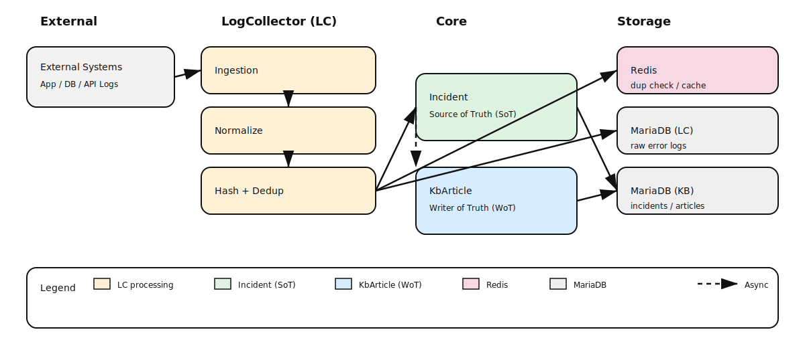

# LogCollector & KnowledgeBase

> **에러 로그를 수집·해싱·중복 제거하고, Incident 단위로 관리하며, 대응 과정을 KnowledgeBase로 축적하는 백엔드 시스템**  
> Java · Spring Boot · Elasticsearch · Redis · Kubernetes · Terraform

반복 에러를 하나의 Incident로 묶고, 해결 이력을 KB Article로 누적해  
재발 시 대응 비용을 낮추는 **에러 로그 → 지식 자산화** 파이프라인을 구현했습니다.  
[LogFixer](../LogFixer)와 연동하여 AI Agent 기반 자동 해결까지 이어지는 전체 흐름의 데이터 원천(Source of Truth)을 담당합니다.

---

## 기술 스택

| 분류 | 기술 |
|---|---|
| **Backend** | Java 17, Spring Boot 3.4.1, JPA, Querydsl |
| **Search** | Elasticsearch 8.15 + Nori 형태소 분석기 |
| **Cache / Queue** | Redis 7 (중복 제거, 로그 큐) |
| **DB** | MariaDB (LC / KB 물리적 분리) |
| **Infra** | Docker Compose, Kubernetes (Terraform + Helm + kubectl) |
| **Monitoring** | Prometheus, Grafana |
| **Test** | Testcontainers, JUnit 5, ArchUnit |

---

## 핵심 구현 포인트

| 항목 | 내용 |
|---|---|
| **로그 해싱 · 중복 제거** | 서비스명 + 정규화된 메시지 + 스택 상단 시그니처를 SHA-256 해싱 → 동일 에러는 하나의 Incident로 수렴. host/ip는 제외하고 `error_log_hosts`로 영향 호스트 수를 별도 관리 |
| **이중 DB 분리 설계** | LC DB(수집·정규화)와 KB DB(Incident·KbArticle)를 물리적으로 분리. Incident를 SoT(Source of Truth)로 두고 상태 프로세스를 단일 기준으로 통제 |
| **Elasticsearch 전문 검색** | KB Article을 Nori 형태소 분석기로 인덱싱. BM25 기반 키워드 검색으로 유사 장애 이력 조회 — LogFixer RAG 파이프라인의 검색 소스로 활용됨 |
| **LogFixer 웹훅 발송** | Incident 생성·갱신 시 이벤트 리스너가 LogFixer로 자동 웹훅 발송. 실패 시 outbox 패턴으로 재시도 |
| **KB Addendum 누적** | LogFixer 해결 완료 후 REST API로 분석 결과·실행 이력을 KbArticle에 addendum으로 추가. 재발 시 지식은 삭제 없이 이력으로 쌓임 |
| **Kubernetes 배포 (Terraform + Helm)** | MariaDB, Redis, Prometheus/Grafana, Spring Boot 앱을 Terraform으로 통합 배포. Kubernetes Job 기반 자동화 테스트(`make test`) 포함 |

---

## 시스템 아키텍처



```
외부 시스템 (앱 서버, DB, API)
      │ POST /api/logs
      ▼
┌─────────────────────────────────────────────────────┐
│                   LogCollector (LC DB)              │
│                                                     │
│  Ingestion          Processing          Dedup       │
│  ──────────         ────────────        ──────────  │
│  로그 수신          정규화 · 요약        Redis        │
│  레벨 추론          SHA-256 해싱         중복 제거    │
│  최소 검증          ErrorCode 분류       로그 큐      │
└─────────────────────────────────────────────────────┘
      │ 이벤트 (LogSavedEvent)
      ▼
┌─────────────────────────────────────────────────────┐
│               KnowledgeBase (KB DB)                 │
│                                                     │
│  Incident (SoT)         KbArticle (WoT)            │
│  ────────────────        ────────────────           │
│  재발 감지 · 상태관리    Draft 자동생성              │
│  host spread 집계        Addendum 누적               │
│  OPEN/IN_PROGRESS/       DRAFT/PUBLISHED/           │
│  RESOLVED/CLOSED         ARCHIVED                   │
│                                                     │
│  Elasticsearch: KB Article 전문 검색 인덱싱         │
└─────────────────────────────────────────────────────┘
      │ webhook push (Incident 생성·갱신 시)
      ▼
  LogFixer (AI Agent 자동 해결)
      │ REST API (해결 완료 후)
      └─ PATCH /incidents/{logHash}/status
         GET  /kb/articles/by-hash/{logHash}
         POST /kb/{kbArticleId}/addendums
```

---

## 전체 처리 흐름

```
[외부 시스템] 에러 로그 전송
      │ POST /api/logs
      ▼
① 수신 · 검증     ── 레벨 추론, 최소 유효성 검사
      │
      ▼
② 정규화 · 해싱   ── 메시지 정규화 + 스택 상단 시그니처
                  ── SHA-256 → logHash 생성
                  ── Redis 큐 적재
      │
      ▼
③ Incident 처리   ── 신규: OPEN 상태로 생성
                  ── 재발: repeatCount 증가, host 추가
                  ── RESOLVED/CLOSED → OPEN 재오픈
      │
      ├─ Draft 조건 충족 시 ─ KbArticle DRAFT 자동 생성
      │                       (host_spread / high_recur 트리거)
      │
      └─ LogFixer 웹훅 발송 ─ POST /api/incident
                              (실패 시 outbox 재시도)

[LogFixer 해결 완료 시]
      │ PATCH /api/incidents/{logHash}/status  →  RESOLVED
      │ GET   /api/kb/articles/by-hash/{logHash}
      │ POST  /api/kb/{kbArticleId}/addendums  →  분석 결과 + 실행 이력 저장
      ▼
KbArticle에 해결 이력 누적 → 다음 유사 장애 시 LogFixer RAG 소스로 재활용
```

---

## 상태 모델

### Incident 상태 (SoT)

```
OPEN ──→ IN_PROGRESS ──→ RESOLVED ──→ CLOSED
  ↑                          │
  └────── 재발 시 재오픈 ────┘ (CLOSED → OPEN 포함)
```

| 상태 | 의미 |
|---|---|
| `OPEN` | 인시던트 신규 오픈 |
| `IN_PROGRESS` | 조치·분석 진행 중 |
| `RESOLVED` | 기술적으로 해결 완료 |
| `CLOSED` | 안정 구간 확인 후 최종 종료 |
| `IGNORED` | 수집·저장 차단 (재발 이벤트 차단) |

### KbArticle 상태

```
DRAFT ──→ IN_PROGRESS ──→ PUBLISHED ──→ ARCHIVED (불가역)
```

후속 조치·해결 기록은 KbArticle을 재작성하지 않고 **Addendum으로 누적**합니다.

---

## LC ↔ LogFixer 연동

| 방향 | 방식 | 내용 |
|---|---|---|
| LC → LogFixer | Webhook push | Incident 생성·갱신 시 자동 발송 |
| LogFixer → LC | REST API 호출 | 해결 완료 후 상태 변경 + addendum 저장 |

---

## 실행 방법

### Docker (권장 — 빠른 검증)

```bash
docker compose -f infra/compose/compose.yaml up -d --build

# API 확인
curl http://localhost:8080/actuator/health

# 로그 수집 테스트
.\test-api.ps1
```

| 서비스 | 주소 |
|---|---|
| Backend API / Swagger | http://localhost:8080 |
| Frontend (검증용) | http://localhost |
| Grafana | http://localhost:3000 (admin/admin) |

### Kubernetes (Terraform + Helm)

```bash
cd infra/terraform
terraform init
terraform apply

# 프론트엔드
kubectl apply -f infra/k8s/06-frontend-deployment.yaml

# 자동화 테스트 (ALL TESTS PASSED! 확인)
make test
```

> Kubernetes 환경에서 Grafana 접근 시 포트 포워딩이 필요합니다.
> ```bash
> kubectl port-forward svc/monitoring-grafana 3000:80 -n monitoring
> ```

### 리소스 정리

```bash
kubectl delete -f infra/k8s/06-frontend-deployment.yaml
cd infra/terraform && terraform destroy
```

---

## 주요 API

| 메서드 | 경로 | 설명 |
|---|---|---|
| `POST` | `/api/logs` | 에러 로그 수집 (Redis 큐 적재) |
| `GET` | `/api/incidents` | Incident 목록 조회 |
| `GET` | `/api/incidents/{logHash}` | Incident 상세 조회 |
| `PATCH` | `/api/incidents/{logHash}/status` | 상태 변경 (LogFixer 호출) |
| `GET` | `/api/kb/articles` | KB Article 목록 / 전문 검색 |
| `GET` | `/api/kb/articles/by-hash/{logHash}` | logHash로 KB Article 조회 |
| `POST` | `/api/kb/{kbArticleId}/addendums` | Addendum 저장 (LogFixer 호출) |
| `GET` | `/api/rank` | Incident 랭킹 (호스트 수 / 재발 횟수 기준) |

Swagger UI: `http://localhost:8080/swagger-ui/index.html`

---

## 프로젝트 구조

```
LogCollector/
├── src/main/java/com/soyunju/logcollector/
│   ├── controller/
│   │   ├── lc/                    # 로그 수집, Incident 상태 변경 API
│   │   └── kb/                    # KB Article, Addendum, 랭킹 API
│   ├── service/
│   │   ├── lc/
│   │   │   ├── crd/               # ErrorLog CRUD
│   │   │   ├── processor/         # 정규화·해싱·ErrorCode 분류
│   │   │   └── redis/             # Redis 큐 적재
│   │   └── kb/
│   │       ├── crud/              # Incident · KbArticle · Addendum CRUD
│   │       ├── search/            # Elasticsearch 전문 검색
│   │       └── webhook/           # LogFixer 웹훅 발송
│   ├── domain/
│   │   ├── lc/                    # ErrorLog, ErrorLogHost (LC DB)
│   │   └── kb/                    # Incident, KbArticle, KbAddendum (KB DB)
│   └── infra/
│       ├── es/                    # Elasticsearch 인덱스 설정
│       └── outbox/                # 웹훅 실패 시 재시도 outbox
├── infra/
│   ├── compose/                   # Docker Compose (로컬 실행)
│   ├── k8s/                       # Kubernetes YAML
│   ├── terraform/                 # Terraform (K8s 통합 배포)
│   └── helm/                      # Helm values (MariaDB, Redis)
└── src/test/
    ├── unit/                      # 단위 테스트
    └── integration/               # Testcontainers 통합 테스트
```
