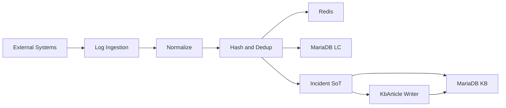

# LogCollector & KnowledgeBase
### 로그에서 지식으로 (From Logs to Knowledge Assets) v1.0

> **“운영 환경의 에러 로그, 버리고 계신가요?”**

단순히 로그를 수집하는 시스템은 이미 많습니다.  
LogCollector & KnowledgeBase는 **에러 로그를 사건(Incident) 단위로 식별하고, 대응 과정을 지식(KnowledgeBase)으로 축적·재활용**하는 것을 목표로 한 백엔드 중심 프로젝트입니다.

이 프로젝트는 단순 로깅이 아니라,  
**에러 발생 → 사건 관리 → 재발 대응 → 지식화** 로 이어지는 운영 흐름이  
**아키텍처와 데이터 책임 구조 차원에서 성립하는지**를 검증하는 데 초점을 둡니다.

---

## Quick Demo (Visual)

복잡한 설정 없이 시스템 동작을 바로 확인할 수 있습니다.

1. **대시보드 접속**
  - http://localhost

2. **시나리오 실행 (로그 발생 시뮬레이션)**
  - `Scenario Mode` 탭 클릭
  - `DB_FAILOVER` 등 시나리오 선택 후 `Run Simulation`

3. **결과 확인**
  - Frontend: `Logs` 탭에서 실시간 로그 유입 및 Incident 생성 확인
  - Grafana: http://localhost:3000 (admin / admin)
    - `LogCollector` 대시보드에서 트래픽 및 에러 변화 확인

---

## Project Goal

운영 환경의 로그는 파편화되어 있으며 대부분 일회성으로 소비됩니다.  
그 결과 동일한 장애가 반복되어도 대응 경험은 개인의 기억에만 의존하게 됩니다.

이 프로젝트는 다음 두 가지 문제를 해결합니다.

- **Noise Reduction**  
  반복적으로 발생하는 로그를 하나의 Incident로 묶어 관리

- **Knowledge Assetization**  
  장애 대응 경험을 시스템의 지식 자산으로 축적

---

## Architecture Overview

이 시스템은 **LogCollector**, **Incident**, **KbArticle** 세 핵심 컴포넌트로 구성되며,  
**Incident를 단일 Source of Truth**, **KbArticle을 Writer of Truth**로 설계합니다.

아래 다이어그램은 로그 유입부터 지식 확정까지의 **핵심 데이터 흐름만**을 표현합니다.



### Core Concepts

- **LogCollector (LC)**  
  로그 수집, 정규화, 해싱, 중복 제거를 담당하는 전처리 계층

- **Incident (Operations View)**  
  운영 관점의 사건 단위  
  상태 관리 및 재발 판단의 **단일 기준(Source of Truth)**

- **KbArticle (Knowledge View)**  
  실제 지식이 저장되는 도메인  
  모든 지식 쓰기의 **유일한 진실 지점(Writer of Truth)**

### Reoccurrence First Design

운영 환경에서 에러는 반드시 재발한다는 가정을 전제로 합니다.  
동일 `log_hash` 재발 시 Incident는 자동으로 OPEN 상태로 회귀하며,  
지식은 삭제되지 않고 이력으로 누적됩니다.

---

## Tech Stack

- Language & Framework
  - Java 17, Spring Boot 3.4.1

- Data
  - MariaDB (LC / KB 물리적 분리)
  - Redis (Deduplication, Cache)
  - JPA / Querydsl

- Infrastructure
  - Docker, Docker Compose
  - Kubernetes (Optional)

---

## Verification Paths

실행 환경별로 검증 경로를 분리합니다.

### 1) Local (run-local)
- 목적: IDE 기반 개발 및 디버깅
- 문서: docs/run-local.md
- 프론트엔드 없음, curl 또는 HTTP Client 기반 검증

### 2) Docker (run-docker) – 주요 검증 경로
- 목적: 재현 가능한 통합 실행
- 문서: docs/run-docker.md
- API Base URL: http://localhost:8080/api

```bash
docker compose -f infra/compose/compose.yaml up -d --build
./test-api.ps1
```

### 3) Kubernetes & Automated Test
- 목적: 클러스터 내부 통합 테스트
- 문서: docs/verify-k8s.md

```bash
make test
```

성공 시 터미널 마지막에 `ALL TESTS PASSED` 메시지가 출력됩니다.

---

## Status Model

상태 관리는 **Incident(운영)** 와 **KbArticle(지식)** 로 분리됩니다.  
상태 정책의 단일 기준은 Incident입니다.

자세한 전이 규칙은 아래 문서를 참조합니다.
- docs/status.md

---

## Scope & Limitations (v1.0)

v1.0의 목적은 기능 확장이 아니라 **운영 흐름과 데이터 책임 구조의 검증**입니다.

의도적으로 제외한 항목:
- Full-text Search (Elasticsearch)
- AI 자동 요약
- 분산 트랜잭션(2PC)

Eventual Consistency와 멱등성 설계로 운영 환경을 충분히 커버할 수 있음을 검증합니다.

---

## Documentation

- docs/run-local.md
- docs/run-docker.md
- docs/run-k8s.md
- docs/status.md
